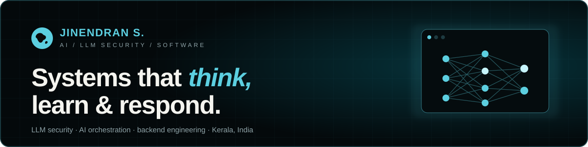

  
  
  
  

## Hi, I'm Jinendran

I'm a final-year B.Tech student in **Artificial Intelligence** at Adi Shankara Institute of Engineering and Technology, Kerala. I work on **LLM security**, **multi-model AI orchestration** and the **backends** that ship them, building AI systems that are powerful *and* safe to trust.

- **Now:** building MIRA, our final-year rehabilitation assistant, and researching defences against data poisoning in LLMs
- **Summer 2026:** interned at **VLED Lab, IIT Ropar** (open-source FLN platform) and **PM Accelerator** (Software Engineer Intern, AI/ML)
- **Open to:** internships, research collaborations and full-time roles from 2027
- **Try this:** can you make my AI gatekeeper leak its password? &rarr; [Hack My AI](https://portfolio-jinendran.vercel.app/#challenge)

## Experience

| Role | Organisation | When |
|---|---|---|
| Summer Intern, Open-Source Contributor | VLED Lab, IIT Ropar (via NPTEL) | Jun – Sep 2026 |
| Software Engineer Intern, AI/ML | PM Accelerator, AI PM Bootcamp (Cohort 9) | Jun – Aug 2026 |

## Featured work

| Project | What it does | My role |
|---|---|---|
| [**LLM Poison Mitigation**](https://github.com/Jinendran10/Mini-Project) | Detects and mitigates backdoor-poisoned training data and prompt injection in LLMs using JIE and RLOD | Development lead, team of 4 |
| [**Misconception Fingerprinting**](https://github.com/vicharanashala/fln/pull/281) | Clusters students' arithmetic errors into misconception archetypes in FLN, an open-source numeracy platform | Designed and shipped (merged) |
| [**Faber AI**](https://github.com/Cohort-9-FaberAI/FaberAI) | AI design-for-manufacturability analysis for 3D parts | Backend APIs, CI and Claude integration, team of 11 |
| [**OrchestrateX**](https://github.com/Atul013/OrchestrateX) | Routes each prompt to the best-suited model, then refines the answer with cross-model critique | Infrastructure and deployment, team of 5 |
| [**WeatherVault**](https://github.com/Jinendran10/Weather-App) | Full-stack weather intelligence platform with CRUD persistence and data export | Solo: FastAPI, PostgreSQL, React, Docker |
| **Prayag '26** ([live](https://prayag26.vercel.app)) | Registration and operations platform for our college tech fest | Second-largest contributor, team of 11 |
| **MIRA** | Muscle-signal (EMG) driven hand-rehabilitation assistant | Secure command layer and FHIR export, team of 4 |

## Tech stack

**Languages** 
    

**Backend and data** 
      

**AI / ML** 
   

**Frontend and DevOps** 
     

## Certifications and hackathons

- **Certified AI Engineer** — PM Accelerator
- **Deep Learning** — NPTEL, IIT Ropar
- **Deep Reinforcement Learning** — Hugging Face
- **Generative AI** — Microsoft
- **Hackathons:** AI Samasya (ICGAIFE 3.0, IHRD Kerala) · YODHA — The Warrior of AI (Jyothi Engineering College)

---

More about me, plus a few games, at <a href="https://portfolio-jinendran.vercel.app"><b>portfolio-jinendran.vercel.app</b></a>

